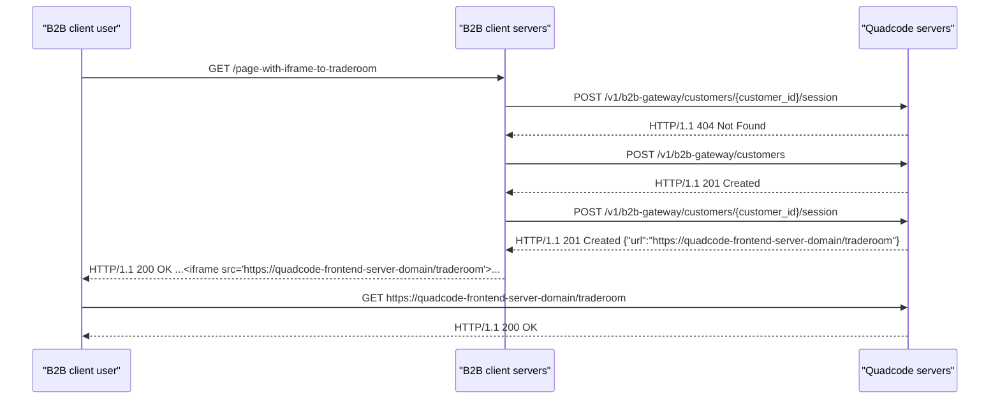
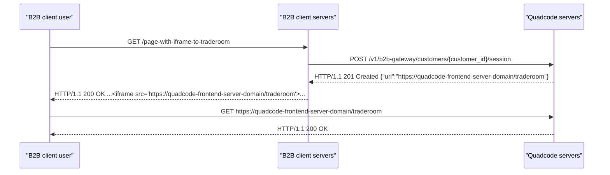
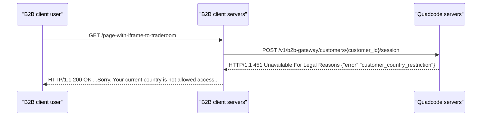
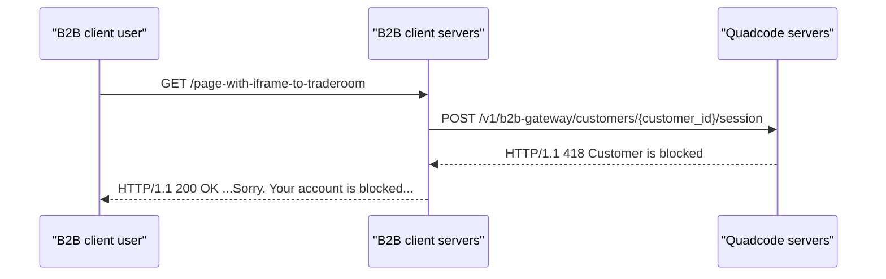
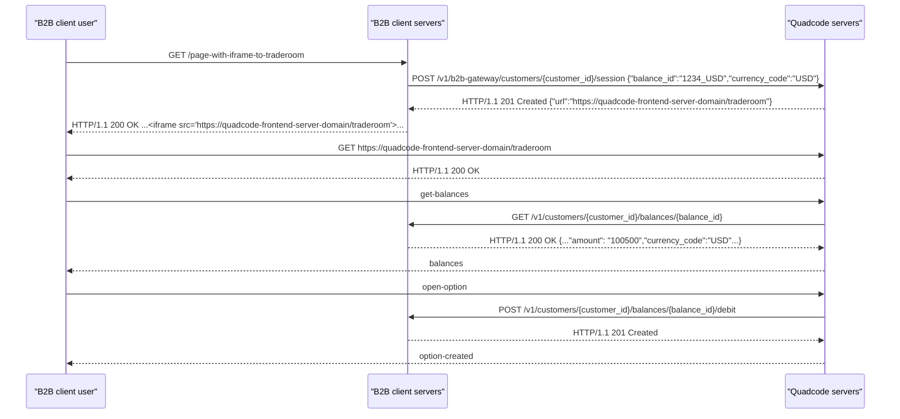
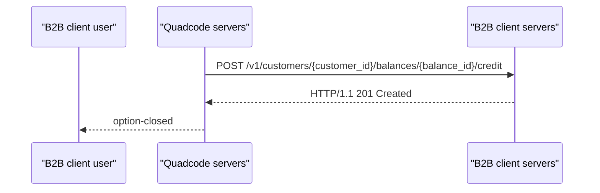
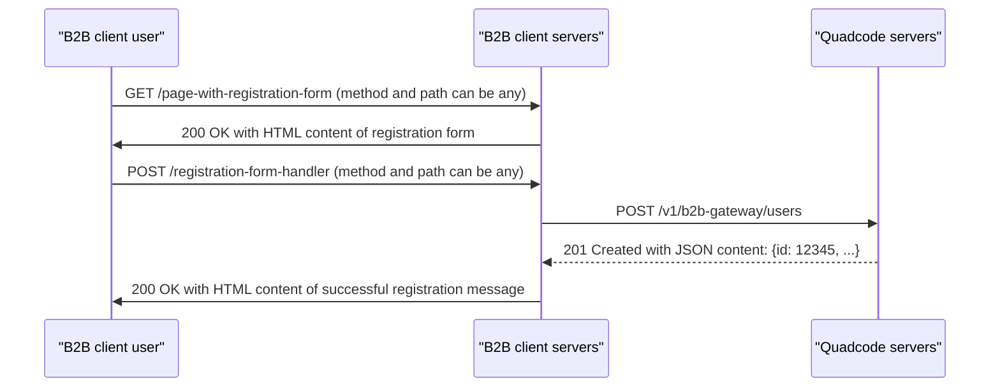
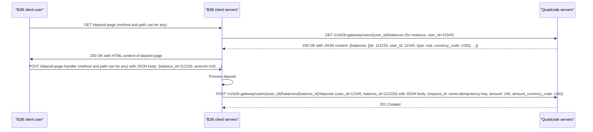
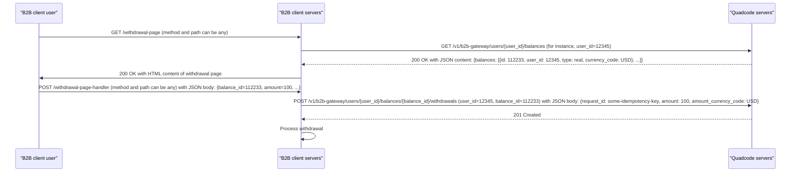
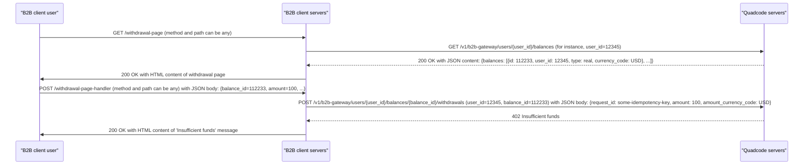

# Quadcode B2B gateway API

Quadcode B2B gateway API OpenAPI specification for external balances configuration is [here](quadcode-external-balance-openapi.yaml).

Quadcode B2B gateway API OpenAPI specification for internal balances configuration is [here](quadcode-internal-balance-openapi.yaml).

B2B client API OpenAPI specification for external balances implementation is [here](b2b-client-external-balance-openapi.yaml).

## Glossary

`User` - this is entity that is stored inside Quadcode system. The user has unique ID used for link the user and balances (aka accounts) which are owned by user.

`Balance` - this is entity that has the following properties: current amount on user's account and account currency. User can have several balances (accounts). The balance has unique ID used for link the balance and positions which was bought on balance (account) funds.

`Traderoom` - frontend-module of Quadcode system. The traderoom provides to user UI for trading.

`integration-environment` - this is test-environment (aka staging) used for testing integration implementation.

## Server to server requests authorization

Authorization is carried out using JWT tokens, which are transmitted via the `Authorization` HTTP header with the `Bearer` prefix. The requester must issue and sign the JWT with their private key. And pass the JWT token through the Authorization header of the HTTP request.

JWT token signing algorithm: `ES256`.

JWT tokens must contain the following claims:

`iss` - for tokens issued by B2B client, claim must have value received by B2B client from Quadcode representatives. For Quadcode issued tokens, claim must have the value `qc`.

`aud` - for a production environment it must have the value `production`. For integration environment must be set to `integration`. For sandbox environment should be `sandbox`.

`iat` - issue date of the token.

`exp` - the token's invalidation date must be within 10 minutes of the current time. That's it, the lifetime of the token should not exceed 10 minutes from the moment the token is issued.

### Instructions for generating API access keys

1) Generate a private key for signing JWT tokens:

```shell
openssl ecparam -name prime256v1 -genkey -noout -out private.pem
```

2) Generate a public key to verify the signature of JWT tokens:

```shell
openssl ec -in private.pem -pubout -out public.pem
```

3) Transfer the `public.pem` file to Quadcode representatives. The `private.pem` file is NOT shared with Quadcode representatives and is only used on the B2B client side to sign JWT tokens.

## Access restrictions by IP address for server to server requests

In server to server communications, in addition to authorization using the JWT token, the IP address of the request sender is checked. The IP address must be included in the list of allowed IP addresses, otherwise the request will be rejected with the status code `403`.

## Limits on the number of requests per second

The Quadcode API contracts check for the number of requests with the same value of `ip` or `user_id` properties in the request. If the limit on the number of requests per second is exceeded, the request will be rejected with the status code `429`.

## Use cases for external balances configuration

[OpenAPI specification](quadcode-external-balance-openapi.yaml).

### User opens Traderoom for the first time



### This is not the first time a user opens Traderoom



### A user from a restricted country opens Traderoom



### Blocked user opens Traderoom



### The user opens Traderoom and buys an option



### The option closed with a profit for the user



## Use cases for internal balances configuration

[OpenAPI specification](quadcode-internal-balance-openapi.yaml).

### When the user wants to create an account



### When the user wants to deposit funds and deposit is processed successfully



### When the user wants to withdraw funds and withdrawal is processed successfully



### When the user wants to withdraw funds and user's balance has insufficient funds


